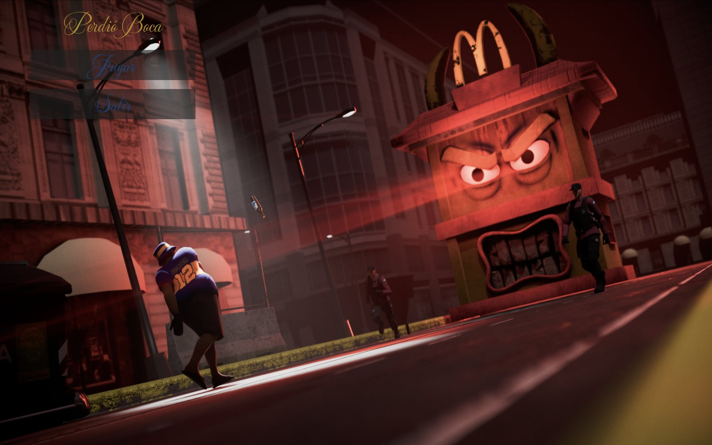
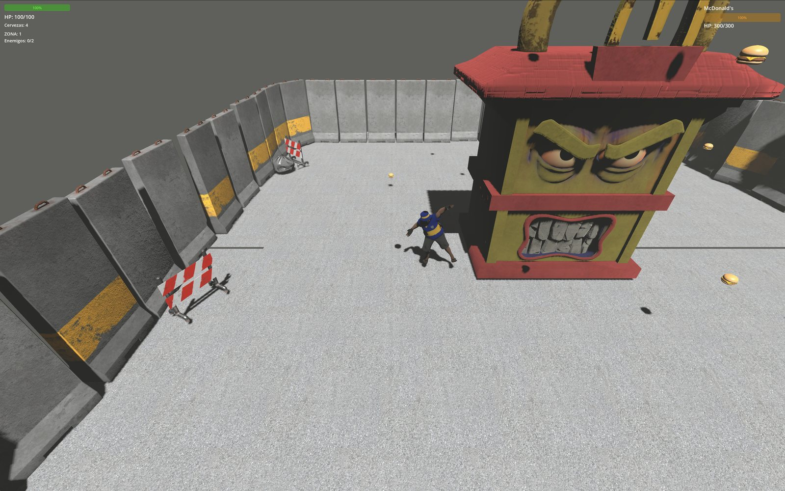
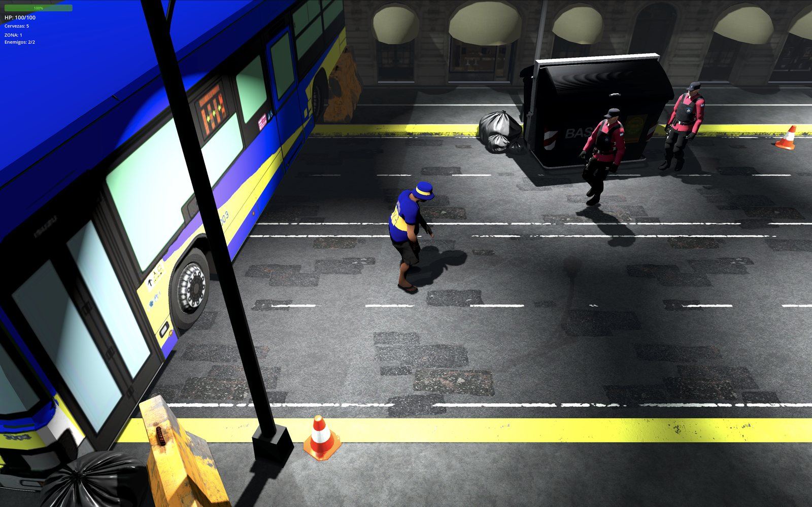
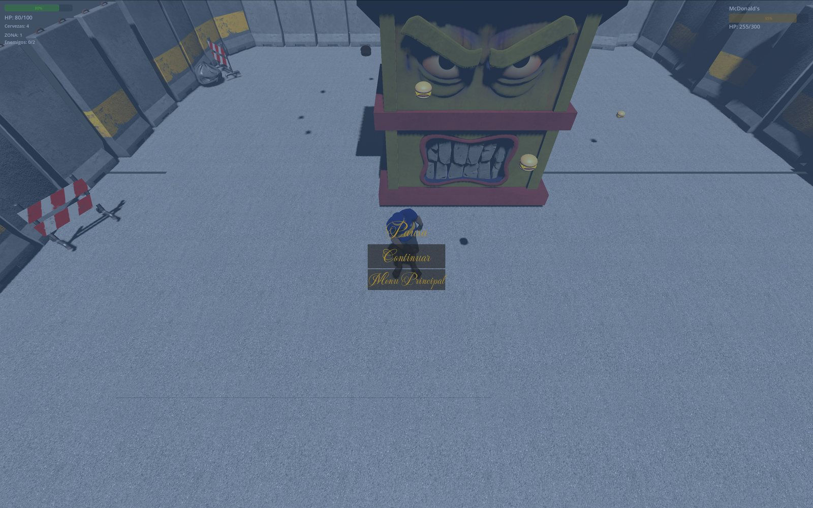

# Perdió Boca

> Boca just lost. Grab a beer and take it out on the street — all the way to a McDonald's with a grudge.

A 3D top-down brawler built in **Godot 4** in 5 days for **Desafío Buenos Aires 2026**, a game jam organized by the Gobierno de la Ciudad Autónoma de Buenos Aires.

**▶ [Play in your browser on itch.io](https://buentipojorge.itch.io/perdio-boca)**



---

## About

You play a *bostero* — a heartbroken Boca Juniors fan — who takes to the streets of Buenos Aires after a loss, punching riot police and hurling beer cans to clear a path. It ends the way every good sports rage does: at a giant, furious McDonald's.

Built solo as programmer and designer in a 4-person team, with two 3D artists and a composer handling the visuals and original score. I wrote all of the game code: player and enemy AI, combat, camera, spawning, progression, and UI.

The finished build was demoed at the jam's closing showcase, played by fellow jammers and invited industry professionals.

## How to play

| Input | Action |
| --- | --- |
| Arrow keys | Move |
| **X** | Punch |
| **C** | Throw a beer |
| **Esc** | Pause |

- **Punch** is short-range and free — your bread and butter.
- **Beers** are a limited ranged resource: bigger damage and knockback, but you only start with a handful, so spend them on tough spots.
- Clear each zone's police officers to advance. **Level 1** is a street-by-street clear; **Level 2** is a boss fight against a 300 HP McDonald's mascot with three escalating attack phases that rain burgers down on the arena.
- Score comes from enemies defeated and time survived.



## Built with

- **[Godot 4](https://godotengine.org/)** — engine, GDScript
- Custom + sourced 3D models and textures (street props, characters, the boss)
- Original music and SFX

## Team

- **Marco Petruccelli** — programming, game design, original idea, production
- 2 collaborators — 3D art and character modelling
- 1 collaborator — original music

## Repository contents

```
scripts/       gameplay code (player, enemies, combat, camera, spawning, UI, progression)
scenes/        Godot scenes — levels, player, enemies, projectiles, UI
assets/        3D models, textures, audio
Web_export/    exported HTML5 build
Screenshots/
```

The exported browser build lives in `Web_export/` (and `Web_export.zip`); the version on itch.io is the one to play.

## Screenshots

| Gameplay | Pause | Boss |
| --- | --- | --- |
|  |  |  |

## Credits

Made for **Desafío Buenos Aires 2026**, organized by the Gobierno de la Ciudad Autónoma de Buenos Aires.
